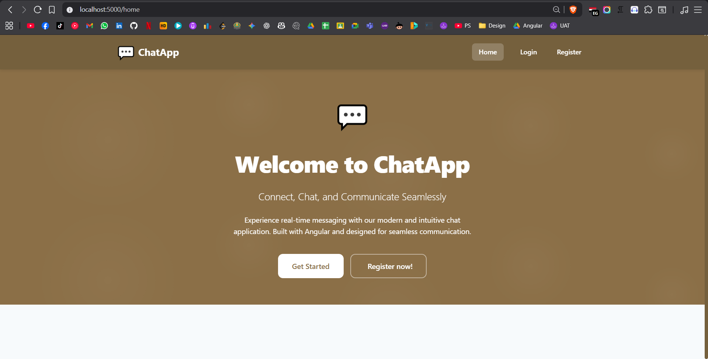
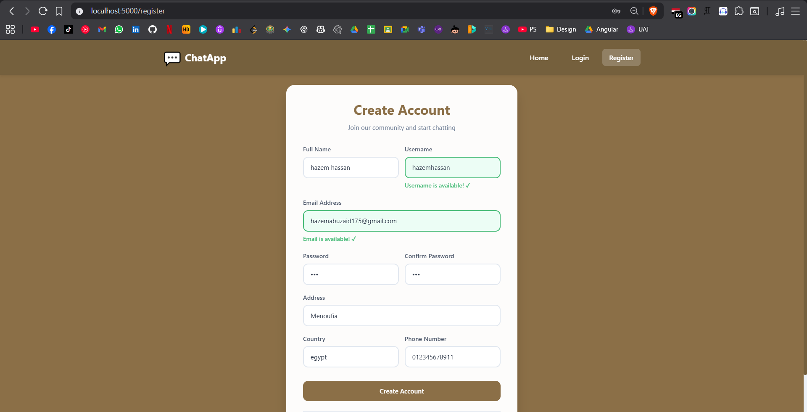
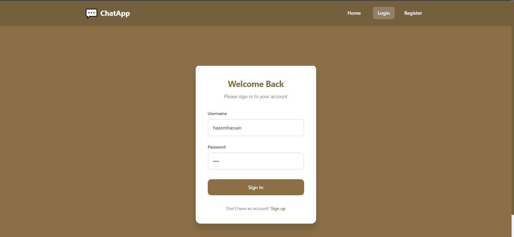
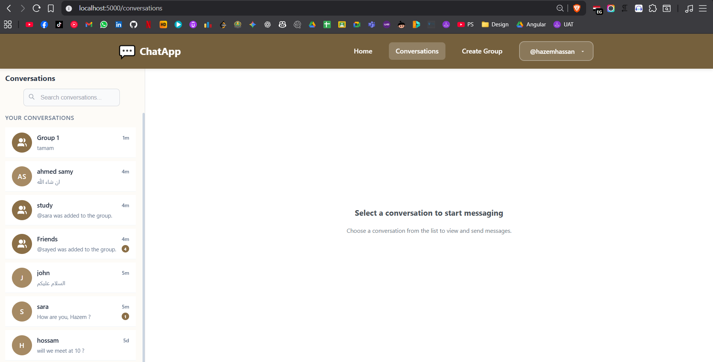
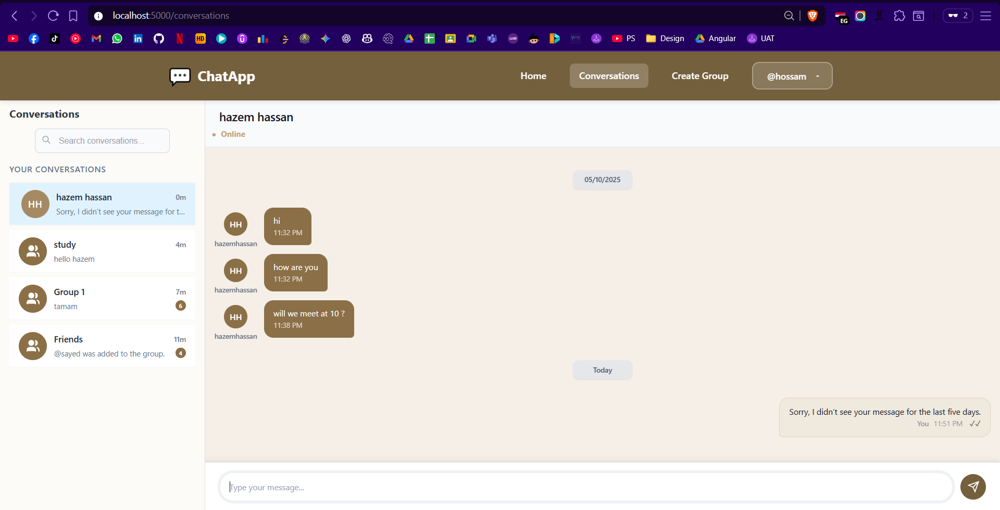
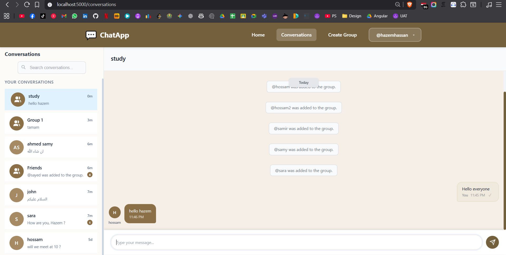
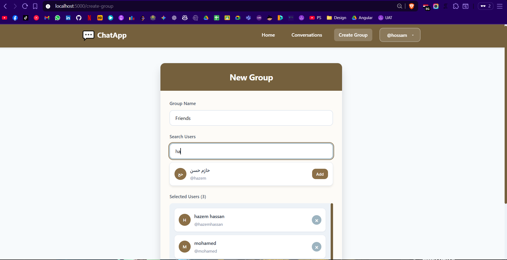
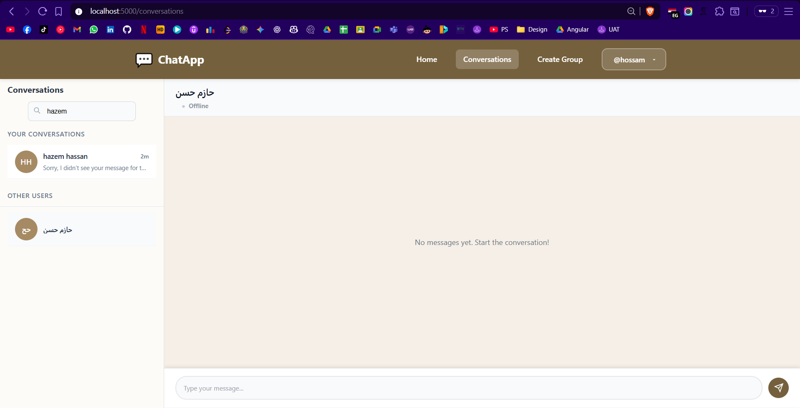

# ChatApp

A real-time chat application built with .NET for the backend and Angular for the frontend.

## Features

- Real-time one-on-one and group chats.
- Secure authentication system using JWT.
- Create and manage conversations and groups.
- Interactive user interface.

## Screenshots

<table>
  <tr>
    <td align="center"><strong>Home</strong></td>
    <td align="center"><strong>Register</strong></td>
  </tr>
  <tr>
    <td></td>
    <td></td>
  </tr>
  <tr>
    <td align="center"><strong>Login</strong></td>
    <td align="center"><strong>Conversations</strong></td>
  </tr>
  <tr>
    <td></td>
    <td></td>
  </tr>
  <tr>
    <td align="center"><strong>Direct Conversation</strong></td>
    <td align="center"><strong>Group Conversation</strong></td>
  </tr>
  <tr>
    <td></td>
    <td></td>
  </tr>
  <tr>
    <td align="center"><strong>Create Group</strong></td>
    <td align="center"><strong>Search New User</strong></td>
  </tr>
  <tr>
    <td></td>
    <td></td>
  </tr>
</table>

## Technologies Used

### Backend

- .NET 8
- ASP.NET Core Web API
- SignalR in Server
- Entity Framework Core
- SQL Server

### Frontend

- Angular
- TypeScript
- HTML/CSS
- SignalR in client

### Others

- Docker / Docker Compose

## Prerequisites

- [.NET 8 SDK](https://dotnet.microsoft.com/download/dotnet/8.0)
- [Node.js and npm](https://nodejs.org/)
- [Angular CLI](https://angular.io/cli)
- [Docker Desktop](https://www.docker.com/products/docker-desktop)
- [SQL Server](https://www.microsoft.com/sql-server/sql-server-downloads)


## Getting Started

### Running with Docker (Recommended)

This is the simplest way to get the application running. You only need Docker and Docker Compose installed. You don't need to clone the entire project.

1.  **Create a folder** for the project on your local machine.
    ```bash
    mkdir ChatApp
    cd ChatApp
    ```

2.  **Download the required files**:
    Download the following two files into the folder you just created:
    - [`docker-compose.production.yml`](https://raw.githubusercontent.com/HaazemHassan/ChatApp/main/docker-compose.production.yml)
    - [`.env.example`](https://raw.githubusercontent.com/HaazemHassan/ChatApp/main/.env.example)

3.  **Configure your environment**:
    Rename `.env.example` to `.env` and update the configuration values inside, especially the `DB_PASSWORD`.

4.  **Run the application**:
    Open a terminal in your project folder and run the following command:
    ```bash
    docker-compose -f docker-compose.production.yml up -d
    ```
    This command will download the pre-built Docker images and start the application, database, and all required services.

    - The **frontend** will be available at: `http://localhost:5000` 
    - The **backend** will be available at: `http://localhost:44000`
